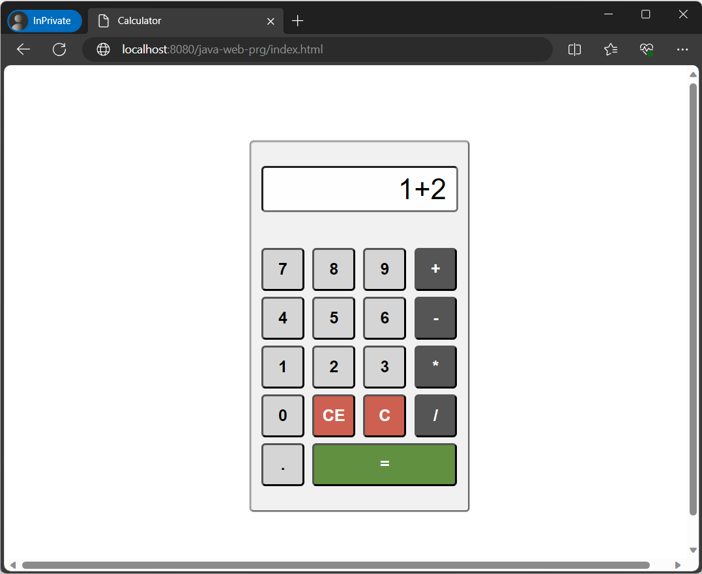
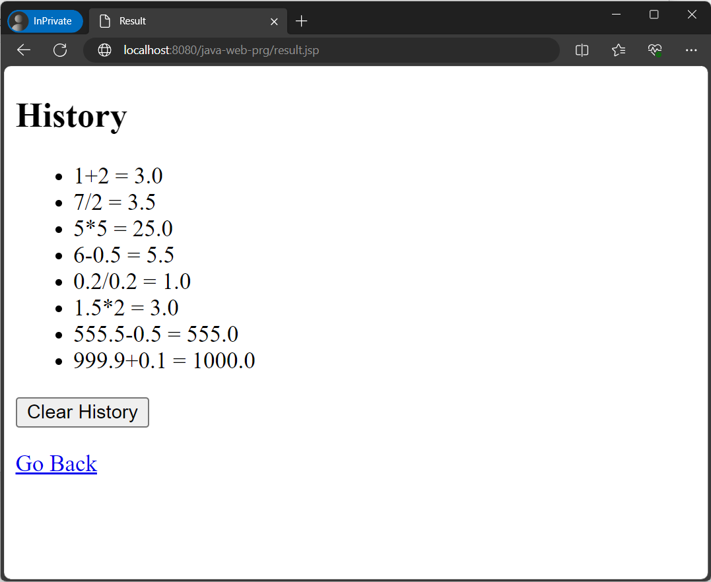
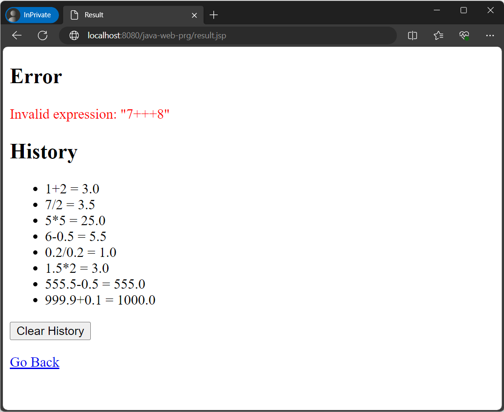

# Basic Expression Calculator

The goal of this task is to create a web-based calculator application according to the Post/Redirect/Get design pattern.

Duration: *45 minutes*

## Description

The application should accept user input from an HTML form, perform calculations, store the history in an HTTP session, and display the results.

Each user's calculation history is saved in the HTTP session. Different browsers can be used for different users.

Develop a Java servlet named `CalculatorServlet` to perform calculations and return the result. You can enter an expression for a calculation using the `index.html` page.

## Requirements

1) Follow the Post/Redirect/Get pattern.

2) Override the `CalculatorServlet.doPost` method.
   - Check for the `action` parameter. If its value is equal to `clearHistory`, remove the `history` session attribute and redirect the client to the `result.jsp` page using the `HttpServletResponse.sendRedirect` method.
   - Parse the `expression` parameter fetched from the request.
   - Evaluate the `expression` and display the results.
   - If an error occurs during calculation, add an attribute named `error` that contains the error message to the current session.
   - If there are no errors, accumulate the calculation results in the `history` attribute of the current session as an ArrayList of strings and remove the `error` attribute.
   - Redirect the client to the `result.jsp` page.

3) Override the `CalculatorServlet.doGet` method. This method should define the error message "Please use the POST method for calculations" as the session attribute `error` and redirect to `result.jsp`.

4) Use a page named `result.jsp` to display the calculation results or any error messages stored in the `history` and `error` session attributes, respectively.

5) It is enough to implement the evaluation of expressions containing simple arithmetic operations ("+," "-," "*," or "/") for two operands of the "double" type.

## Examples

Examples of correct expressions for calculations and the corresponding results stored in the calculation history is shown below:

```
"3+2", "3+2=5.0"
"10-2", "10-2=8.0"
"5*5", "5*5=25.0"
"10/2", "10/2=5.0"
"0.5*2", "0.5*2=1.0"
"5*0.2", "5*0.2=1.0"
"0.5/2", "0.5/2=0.25"
```

Examples of incorrect expressions and corresponding error messages is shown below:

```
"10/0", "Division by zero error!"
"5**", "Invalid expression: "5**""
"39", "Invalid expression: "39""
```

An example of entering the correct expression using the `index.html` page is shown below:



The results of the calculations of the correct expressions, displayed using the `result.jsp` page, are shown below:



An example of entering an incorrect expression using the `index.html` page is shown below:


An example of displaying an error message using the `results.jsp` page is shown below:


