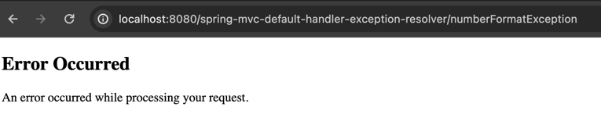
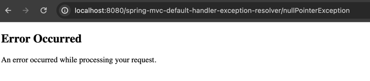

# Exception Handling in Spring MVC using DefaultHandlerExceptionResolver and Thymeleaf

This assignment focuses on understanding the default exception handling mechanism provided by Spring MVC. By intentionally triggering exceptions and observing their handling, you will gain insights into the robustness of Spring MVC's error management and how to provide informative error views to the user.

Duration: _20 minutes_

## Description
Learn exception handling in a Spring MVC application using the default ```DefaultHandlerExceptionResolver```. You will create a simple web application that intentionally triggers different types of exceptions and observe how they are handled by the ```DefaultHandlerExceptionResolver```. Thymeleaf will be used as the ```ViewResolver```.

### Steps
- Add dependencies for Spring MVC, Thymeleaf, and Servlet API.
- Configure ```web.xml``` 
  - Define ```DispatcherServlet```. 
  - Specify servlet mapping.
- Create Controller Class 
  - Develop a controller with ```@Controller```. 
  - Implement methods that will trigger various exceptions (e.g., ```NumberFormatException```, ```NullPointerException```).
- Thymeleaf Configuration 
  - Set up Thymeleaf as the template engine in the Spring configuration. 
- Implement Error View 
  - Create a Thymeleaf template for displaying error messages.
- Testing 
  - Deploy and test the application on a server (e.g., Tomcat). 
  - Trigger exceptions and observe how they are handled and displayed.

## Requirements
- Receiving an HTTP request.
- Mapping the request to a controller.
- Display Thymeleaf template for error messages.
- Correct configuration and implementation of Spring MVC with Thymeleaf.
- Functional exception handling using ```DefaultHandlerExceptionResolver```.
- A report detailing the types of exceptions triggered and how ```DefaultHandlerExceptionResolver``` handled them.
- Screenshots showing the application's response to the triggered exceptions.

## Example of result


