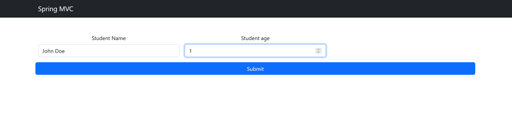
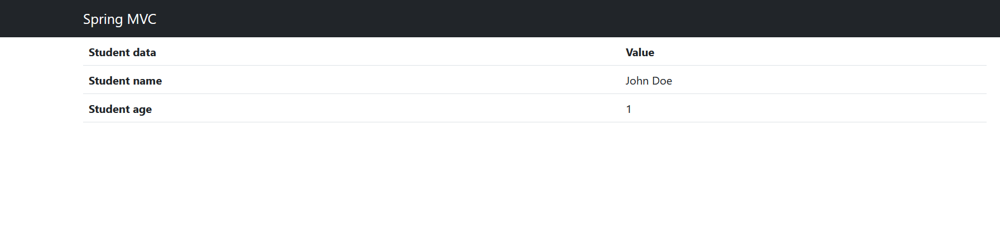

# ModelAndView and ModelMap (application in java-based-configuration)

The purpose of this task is to practice using Spring MVC Application for Form Handling with ModelAndView and ModelMap using Thymeleaf.

Duration: _45 minutes_.

## Description  
Develop a Spring MVC application using Java-based configuration to understand form handling with ModelAndView and ModelMap. The task involves creating and processing a form with various field types,
utilizing Thymeleaf as the ViewResolver.

### Steps
 - Implement Web Application Initializer
   + Replace web.xml with a class implementing WebApplicationInitializer.
 - Create Java Configuration Class
   + Develop a configuration class with @Configuration and @EnableWebMvc.
   + Configure Thymeleaf as the template engine.
 - Create a Model Class
   + Develop a Java class (e.g., FormData) to represent the form data.
 - Create Controller Class
   + Develop a controller with @Controller.
   + Implement methods using ModelAndView for displaying the form and ModelMap for processing form data.
 - Create Thymeleaf Templates
   + Develop Thymeleaf templates for the form and result views.

## Requirements
   + Configure thymeleaf template engine properly in edu.epam.fop.presentation.web.WebConfig
   + Compilete edu.epam.fop.presentation.web.controllers.FormController
   + Deploy and test the application on a server (e.g., Tomcat).
   + Verify that data user input displaying in the table when user submit a form

## Example of result

