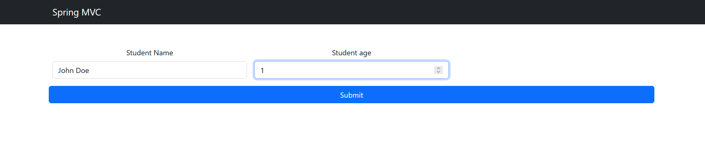
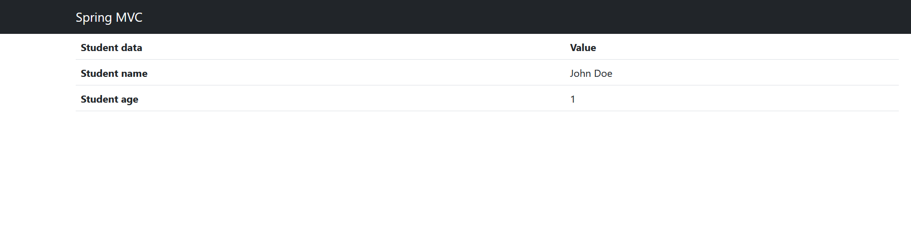

# ModelAndView and ModelMap (application in xml-based-configuration)

The purpose of this task is to practice using Spring MVC Application for Form Handling with ModelAndView and ModelMap using Thymeleaf.

Duration: _45 minutes_.

## Description
Create a Spring MVC application using web.xml configuration to understand the usage of ModelAndView and ModelMap in form handling. This task involves creating a form with various field types and processing the form data upon submission, using Thymeleaf as the ViewResolver.

### Steps
 - Configure web.xml
   + Define DispatcherServlet.
   + Specify servlet mapping.
 - Create a Model Class
   + Develop a Java class (e.g., FormData) to represent the form data.
 - Create Controller Class
   + Develop a controller with @Controller.
   + Create methods for displaying the form (@GetMapping) and processing the form data (@PostMapping), utilizing ModelAndView and ModelMap.
 - Thymeleaf Configuration
   + Set up Thymeleaf as the template engine in Spring configuration.
 - Create Thymeleaf Templates
   + Develop Thymeleaf templates for the form and the result view.

## Requirements
  - Insert Thymeleaf view resolver configuation into webmvc-context.xml
  - Compilete edu.epam.fop.presentation.web.controllers.FormController
  - Deploy and test the application on a server (e.g., Tomcat).
  - Fill in the form and submit to ensure correct data processing

## Example of result

